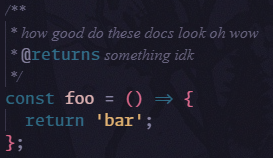

# VSCode Config

### It's just like Neovim, but slow!

Custom VSCode config that is fully supported by Settings Sync. Most of the keybindings and inspiration were lifted from my [`nvim config`](https://github.com/alistairmacvicar/init.lua/tree/main).

## Is This a War Crime?

Maybe. What's more of a crime is constantly changing workstations/operating systems and never having a consistent nvim config/development environment as a result.

## Why VSCode?

Every workstation I've ever touched already has VSCode installed, or is on a pre-approved list from the SysAdmin team.

VSCode Settings Sync lets me save all of my custom settings and extensions on my account, so that when I log into any workstation, everything is exactly the same as it always is.
Bliss.

## Extensions

Most of them are pretty run of the mill, just language servers and version control stuff.
The only ones that do something different are:

- [Better Comments](https://marketplace.visualstudio.com/items?itemName=aaron-bond.better-comments) - Aaron Bond
- [Prettier Vscode](https://marketplace.visualstudio.com/items?itemName=esbenp.prettier-vscode) - Prettier.io
- [Vscode Harpoon](https://marketplace.visualstudio.com/items?itemName=tobias-z.vscode-harpoon) - Tobias Zimmermann
- [Vim](https://marketplace.visualstudio.com/items?itemName=vscodevim.vim) - VSCodeVim
- [Background](https://marketplace.visualstudio.com/items?itemName=shalldie.background) - shalldie

## Key Bindings

This is where things get fun.
Most of these were just translated from my [`nvim config`](https://github.com/alistairmacvicar/init.lua/tree/main), but I've tried to use VSCode's functions as much as I can so that things are native.

Listing them all here will just clutter this file, so you can find them here: [Keybindings](docs/KEYBINDINGS.md).

## Appearance

### Fonts

 
  

I use [Monaspace Argon](https://monaspace.githubnext.com) for the editor and terminal with all ligatures enabled.
Comments are _italic_ which makes bigger files feel less cluttered when there are comments out the wazoo.
When VSCode finally finish implementing Rendered Doc Comments [(It's been backlogged for 3 years)](https://github.com/microsoft/vscode/issues/153984) I'll reconsider this.

### Editor

 
  

I use [Neorose Vimpine (Theme)](https://vscodethemes.com/e/rexcor.neorose-vimpine/neorose-vimpine), a VSCode port of [Rosé Pine](https://github.com/rose-pine/neovim).
The [Background]() extension is used to add a background to VSCode, but I have it at `"opacity": 0.1` so that it's just a nice little touch
